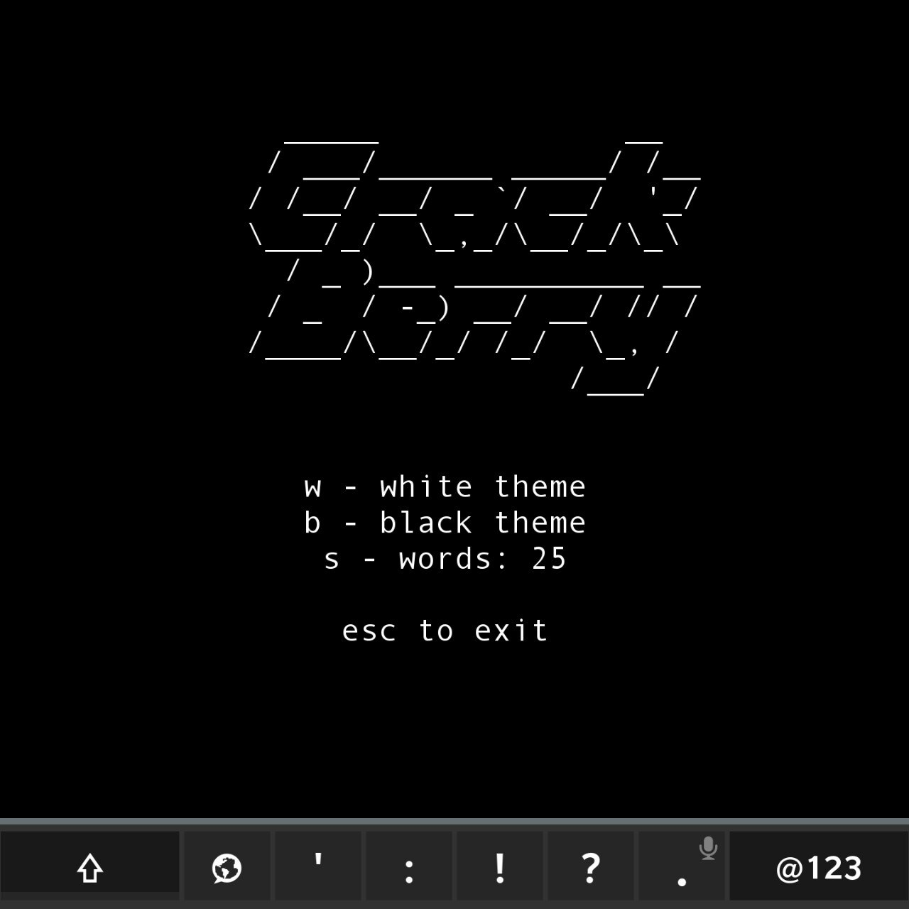
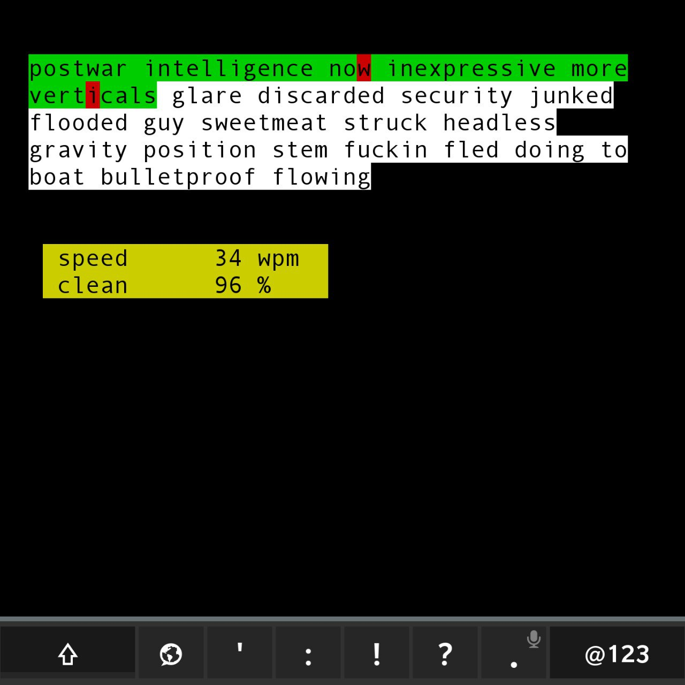
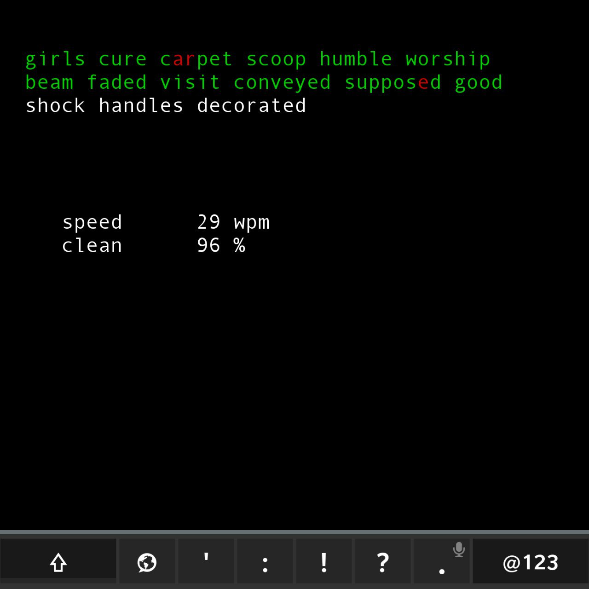
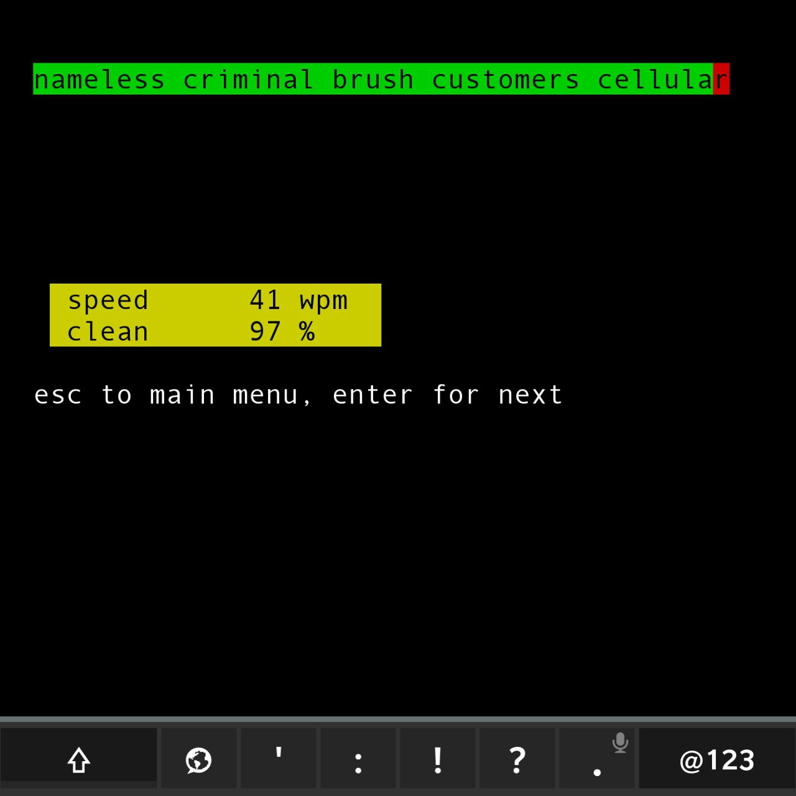

# Typing Speed Test

A simplest typing app created to interact with a Blackberry Passport keyboard due to unavailability of Monkeytype, Clicks Quest, etc. because of the limited web-browser

Switch themes: black-on-white and white-on-black

Word count options 5 - 10 - 15 - 20 - 25 words

neuromancer.txt – 13k lowercase words without punctuation from William Gibson's Neuromancer

## Requirements
https://github.com/sw7ft/BerryCore/https://github.com/sw7ft/BerryCore/ is required

Tested in Term49, font_size = 50 is recommended. The font size is not configurable inside the app

## Installation
clone the repo, run `python app.py` 
